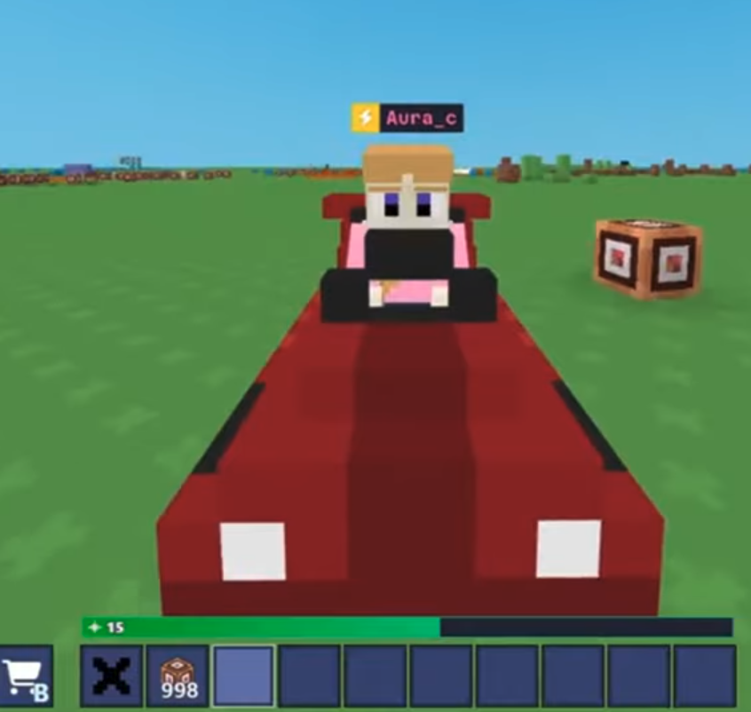

# bloxd cool code!

hi there!there's bloxd cool code assemble,There are many carzy commands here.Without further ado,let's get started!  

## Source of instruction part
[youtube](https://www.youtube.com/@AURANESZZ)
[bloxdium](https://bloxdium.com/codes)
[bilibili](https://www.bilibili.com/video/BV1C9hpzYEE4?spm_id_from=333.788.videopod.sections&vd_source=135477e3c9bc1f754abd09b142f70c25)

These are all things I found online.  

## code part

### "magic staff":
```javascript

onPlayerClick = (id) =>{
  let facing = api.getPlayerFacingInfo(id).dir;
  let pos = api.getPosition(id);
let amount = 8;

let held = api.getHeldItem(id);

let name = held?.attributes?.customDisplayName;
if (name == "magic staff"){
  api.broadcastSound("cannonFire3",1,5,{
    playerIdOrPos: id,
    maxHearDist: 15
  });
  for (let i = 0; i < amount; i++){
    let hit = [];
    hit = [];

api.playParticleEffect({
  dir2: [1, 0, 1],
  dir1: [facing[0], facing[0], facing[2]],
  pos1: [pos[0] += ((i+2)*facing[0]) , pos[1] +1, pos[2] += ((i+2)*facing[2])],
  pos2: [pos[0] += ((i+2)*facing[0]), pos[1] +1, pos[2] +=((i+2)*facing[2])],
  texture: "glint",
  minLifeTime: 0.05 + (i/100),
  maxLifeTime: 0.05 + (i/100),
  minEmitPower: 2,
  maxEmitPower: 2,
  minSize: 0.5,
  maxSize: 3 - (i/10),
  manualEmitCount: 10,
  gravity: [0, -2, 0],
  colorGradients: [
    {
      timeFraction: 0,
      minColor: [225, 97, 3, 1],
      maxColor: [225, 128, 114, 1],
      //rgb(255, 81, 0)
    },
  ],
  velocityGradients: [
    {
      timeFraction: 0,
      factor: 1,
      factor2: 1,
    },
  ],
  blendMode: 1,
});

const magnitude = Math.sqrt(
  facing[0] * facing[0] +
  facing[1] * facing[1] +
  facing[2] * facing[2]
);

const normalized = [
  facing[0] / magnitude,
  facing[1] / magnitude,
  facing[2] / magnitude
];

let x = Math.floor(pos[0] + normalized[0]* i);
      let z = Math.floor(pos[2] + normalized[2] * i);
      let y = Math.floor(pos[1]);

hit = api.getEntitiesInRect([x- 3,y - 3,z - 3],[x + 3,y + 3,z + 3]);

if (hit){

for (let h = 0; h < hit.length; h++){
  let target = hit[h];
  if (hit[h] != id){
  api.attemptApplyDamage({
    eId: id,
    hitEId: target,
    attemptedDmgAmt: 3000,
    withItem: "Stick",
    attackDir: [facing[0],facing[1],facing[2]],
    showCritParticles : true,
    reduceVerticalKbVelocity : false
  });
}
}
}
  }
}
}

```
just one click,the magic staff can emit a particle effect hit to enemy,Deal 2000 damage.  
use this code to get magic staff:  
```javascript

api.giveItem(myId,"Stick",1,{
  customDisplayName:"Magic Staff" ,
  customDescription:"cannon!fire!" ,
  customAttributes:{"enchantments":{"Attack Speed":200}},
  enchantmentTier:"Tier 5"},
})

```

## car
```javascript

const speed = 2;
onPlayerClick = (playerId, wasAltClick) => {
    try {
        if ("INTERNAL_MESH_Kart" === api.getHeldItem(playerId) ? .name) "undefined" == typeof Riding && (Riding = {}), Riding[playerId] ? (Riding[playerId] = !1, api.setPlayerPose(playerId, "standing"), api.updateEntityNodeMeshAttachment(playerId, "TorsoNode", null), api.setClientOption(playerId, "speedMultiplier", 1)) : (Riding[playerId] = !0, api.setPlayerPose(playerId, "driving"), api.updateEntityNodeMeshAttachment(playerId, "TorsoNode", "BloxdBlock", {
            blockName: "INTERNAL_MESH_Kart",
            size: 10,
            meshOffset: [0, 0, 0]
        }, [0, -1, -.2], [6.28, 3.15, 0]), api.setClientOption(playerId, "speedMultiplier", speed))
    } catch (e) {}
};

```
With this world command, the effect of holding the car block (displayed as a cross in the image) given by the following command is as shown in the figure:
 


